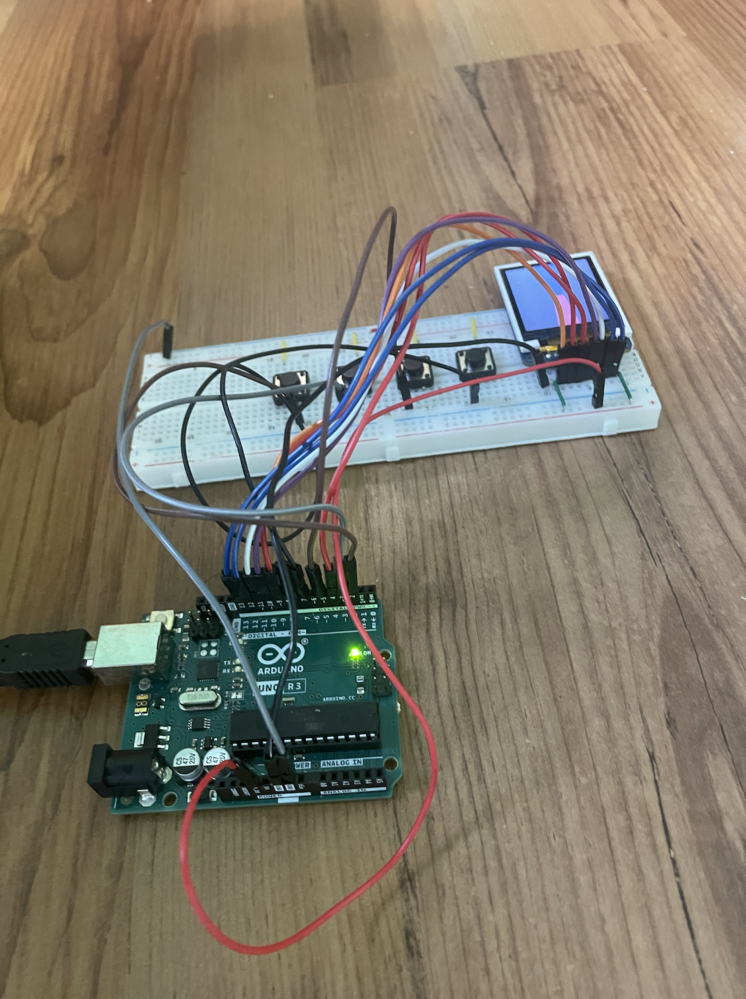

## Raycaster with Arduino
Ported a raycaster onto an Arduino so it can be useable with buttons.

### Materials:
1. 160 x 128 TFT Display (ST7735)
2. Arduino UNO
3. Jumper wires
4. Breadboard
5. 4 Buttons

### Setup:

https://github.com/user-attachments/assets/c71b0a10-495b-44a8-a3df-c3893e2f6128

### Arduino UNO Pin Connections

| ST7735 Pin | Arduino UNO Pin        |
|------------|------------------------|
| LITE       | 3.3V                   |
| MISO       | D12                    |
| SCK        | D13                    |
| MOSI       | D11                    |
| TFT_CS     | D10                    |
| CARD_CS    | D4                     |
| D/C        | D9                     |
| RESET      | D8                     |
| VCC        | 3.3V                   |
| GND        | GND                    |

| Button     | Arduino UNO Pin        |
|------------|------------------------|
|1 (backward)| 7                      |
|2 (forward) | 5                      |
|3 (left)    | 3                      |
|4 (right)   | 2                      |
